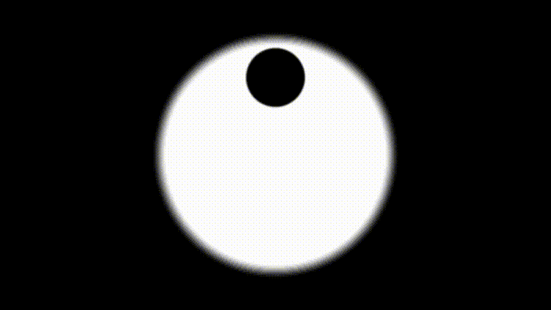

# shader-demos
Collection of shader demos

## My First Shader
The first shader I created in my journey of learning how to make cool shader art.
I used [Part 1](https://www.youtube.com/watch?v=u5HAYVHsasc) and [Part 2](https://www.youtube.com/watch?v=GgGBR4z8C9o) of the tutorial by [The Art of Code](https://www.youtube.com/channel/UCcAlTqd9zID6aNX3TzwxJXg) and borrowed some code from [this](https://www.shadertoy.com/view/XsGfWw) shader

## Rotating Cube
The second shader I created borrowing code from [this](https://www.shadertoy.com/view/MlcGDB) shader in order to create a line drawing function. The code for projecting the cube vertices is my own but likely inspired and borrowed from somewhere long ago.

## How it's done
For creating these gifs I recorded a webm inside the shadertoy web viewer then trimmed it down to size in Davinci Resolve and used ffmpeg to convert it into a gif. I may have to streamline this in the future